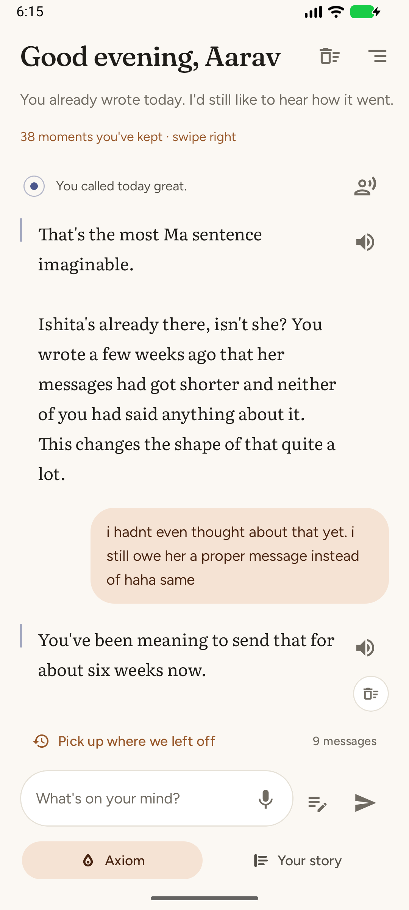
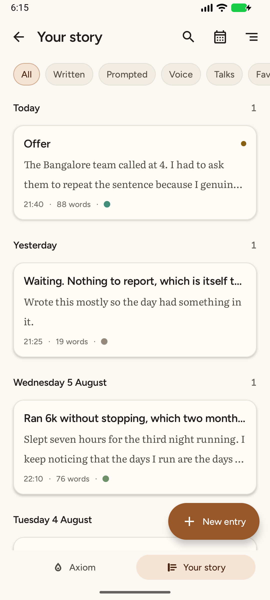
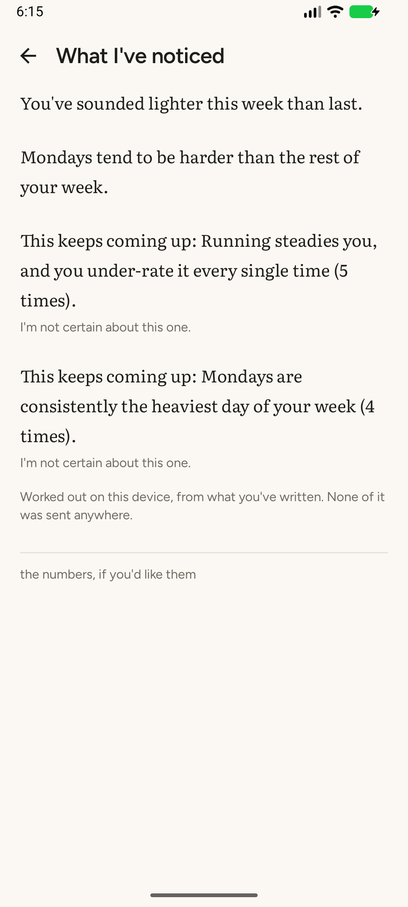
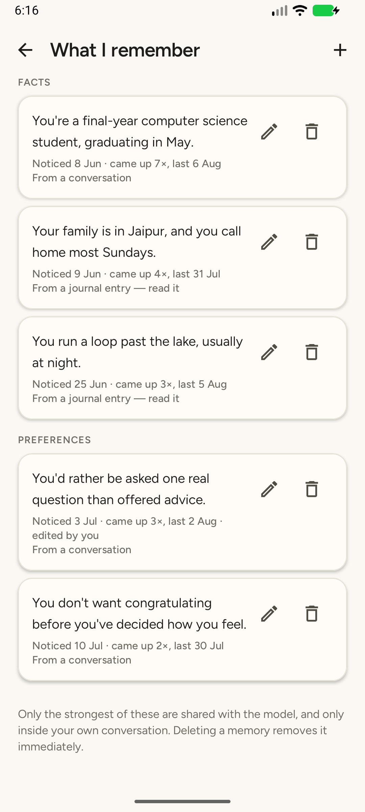
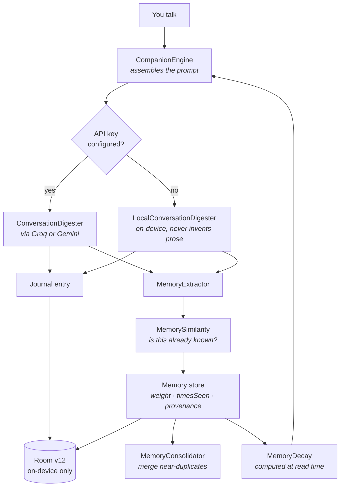

<div align="center">


# Axiom

**A journal that remembers you — and keeps everything on your phone.**

[](https://kotlinlang.org)
[](https://developer.android.com/jetpack/compose)
[](https://developer.android.com/tools/releases/platforms)
[](https://developer.android.com/tools/releases/platforms)
[](docs/ENGINEERING.md#4-persistence-and-schema-evolution)

[Live site](https://okayanshul.github.io/axiom-site/) ·
[Engineering write-up](docs/ENGINEERING.md) ·
[Privacy policy](PRIVACY.md)

</div>

<p align="center">
  
  
  
  
</p>

---

## What it is

Journalling apps fail the same way: a blank page is intimidating, and there is no reason to come
back tomorrow. Axiom makes the home surface a **conversation** instead. You say how the day went;
when you leave, the conversation is digested into a proper journal entry written in your own
voice, and filed.

It remembers — people, facts, goals, preferences, open loops — and shows you exactly what, line by
line, with provenance on every item. Mention an interview on Tuesday and it asks how it went on
Wednesday. Once.

There is no account, no server and no telemetry. AI features are optional and run on an API key
**you** supply for an account **you** own; with no key configured there is still a complete
journal, because every other subsystem runs on the device.

## How a conversation becomes memory



The loop back into the prompt is the whole design: what the model is told next time is a function
of what it was told before, filtered by what has survived decay.

---

## What you actually get

Twelve screens, two home-screen widgets and a Quick Settings tile.

### The companion

| Feature | Detail |
|---|---|
| **Talk instead of compose** | The home surface is a conversation. Say how the day went; leaving digests it into a journal entry in your own voice |
| **It speaks first** | One message a day, only on days you have not been by, plus a look back on Sundays. **Off by default.** You pick morning, midday, evening or night — named times rather than a clock face, because it is a preference about the shape of your day |
| **Answer from the shade** | Reply to a check-in straight from the notification, without opening the app |
| **Open loops** | Mention an interview on Tuesday, get asked on Wednesday — then it drops the subject, because a companion that nags is one you stop talking to |
| **Memory you can audit** | People, facts, goals, preferences and open loops, each with provenance — *noticed 8 Jun · came up 7×* — all editable and deletable |
| **Talks** | Every past conversation, kept by the day it happened |

### The journal

| Feature | Detail |
|---|---|
| **Timeline** | Everything you have kept, grouped by day, with mood indicators |
| **Composer & reader** | One markdown renderer and one composer across the app, with a formatting toolbar |
| **Calendar** | A month at a glance, and every day you showed up |
| **Search** | FTS4 full-text *and* a semantic index — "when did I feel like this before?" is a different question from "which entries contain these words" |
| **Patterns** | Which weekday runs hardest, whether this week reads lighter than last, which people your better days cluster around — worked out on-device, and silent when there is not enough to say |
| **Voice notes** | Dictation with on-device recognition. Hindi and Hinglish are first-class, including in search |

### Everywhere else

**Quick Note widget** and a **notes-list widget** built with Glance · a **Quick Settings tile** for
the thought you would otherwise lose · an **encrypted whole-journal export** and restore, so an
update never costs you your writing · **onboarding** that explains the privacy model before asking
for anything.

### Safety and privacy

Crisis detection runs on-device with **no model, no network and no key**, because someone in
distress at 3am without an API key configured is exactly the person who must not hit a dead end.
Mood classification, pattern detection and semantic search are all local too. AI is **opt-in**: with
no key, you still have a complete journal.

---

## Engineering

**32,789 lines of Kotlin across 230 files** (190 main, 35 test), single module, Compose-only.

| Area | What's there |
|---|---|
| **UI** | Jetpack Compose throughout; a design system ("Ember & Paper") with semantic colour, bundled variable fonts and motion tokens; shared-element transitions between list and detail |
| **Navigation** | Type-safe `@Serializable` destinations — no string routes, no `savedStateHandle.get<Long>("id")` |
| **Persistence** | Room v12 · **14 entities** · **11 DAOs** · **5 hand-written migrations**, two of which repair *data* rather than schema |
| **Search** | FTS4 with the `unicode61` tokenizer, plus an on-device semantic index (TF-IDF with co-occurrence query expansion) |
| **AI** | Provider abstraction over Groq and Gemini, routed per call with per-task model selection, streamed |
| **On-device** | Mood classification, pattern detection, semantic search and distress detection — all with no network and no key |
| **Background** | WorkManager via `@HiltWorker` for digests, check-ins, consolidation and notification replies |
| **Security** | API keys in `EncryptedSharedPreferences` behind an Android Keystore master key |
| **Release** | R8 with hand-written keep rules, resource shrinking, signing that degrades gracefully |
| **Tests** | **347 tests across 34 files**, including a Room migration chain test |

`domain/` has **no Android dependencies** across its 12 packages, which is why the interesting
logic runs as plain JVM tests — no Robolectric, no emulator, fast enough that they actually get
run.

**[Read the full engineering write-up →](docs/ENGINEERING.md)**

---

## Six decisions worth defending

Each of these had an obvious alternative that was rejected for a stated reason.

### Mood classification without a model file

Multinomial naive Bayes trained on the user's own labelled entries, on their own device.
*Rejected: a bundled pretrained sentiment model* — 30–100 MB, slow cold start, and weakest exactly
where this app cannot afford to be. Because it learns *your* vocabulary rather than a general one,
Hindi, Hinglish and private shorthand work for free. A general model knows what "terrible" means;
this one learns what your bad days sound like.

### Semantic search without embeddings

Full-text search answers "which entries contain these words". It cannot answer the question people
actually ask a journal — *when did I feel like this before?* — because today's words are not the
words you used then. TF-IDF with co-occurrence query expansion scores whole-document similarity
instead. *Rejected: a bundled sentence encoder*, for the size and cold-start cost, and because
code-mixed writing is where it degrades worst.

### One definition of "the same memory"

There were **three** answers to this in the codebase, and they disagreed: true Jaccard at 0.6 in
the extractor, containment at 0.6 in the local digester, Jaccard-with-a-stoplist at 0.55 in the
consolidator. Because containment and Jaccard diverge sharply when one text is much shorter, a
memory could be judged *novel* on the way in and a *duplicate* a week later — written, then
silently merged away. To the user, that reads as the app forgetting what they said.

Now one definition with two deliberate uses: `jaccard` for "are these the same memory", where
length matters; `containment` for "have we already got this", where it does not.
→ [`MemorySimilarity.kt`](app/src/main/java/com/cosmiclaboratory/axiom/domain/memory/MemorySimilarity.kt)

### Migrations that repair data, not just schema

Five hand-written migrations from a fixed baseline; two of them fix **data**. One nulls a field
that had been recording the wrong value, choosing honesty over false precision. One deletes junk
memories a bug had been feeding to the model as facts about the user — and it carries a **frozen
copy** of the stop list rather than referencing the live one, because a migration has to produce
the same result on every device forever.

### Statistics that know when to be quiet

Every pattern has a threshold below which it says nothing: three samples for a weekday claim,
three days in each window for a trend, a mood gap of 0.6 before a difference is worth mentioning.
An app that tells you what it noticed after four entries is guessing, and you will learn to
distrust it. Silence is a feature.

### Crisis detection that cannot fail

Plainly-stated distress is matched on-device with **no model, no network and no key** — because
someone in crisis at 3am without an API key configured is exactly the person who must not hit a
dead end. Tuned for precision over recall on purpose: wrongly telling someone having a bad Tuesday
that you think they are in danger teaches them the app over-reacts, and then they stop telling it
things.

---

## If you're reviewing this code

Six files that carry the most judgement, in reading order:

| File | Why |
|---|---|
| [`domain/memory/MemorySimilarity.kt`](app/src/main/java/com/cosmiclaboratory/axiom/domain/memory/MemorySimilarity.kt) | Three disagreeing definitions unified into one, and the user-visible bug that caused |
| [`domain/memory/MemoryDecay.kt`](app/src/main/java/com/cosmiclaboratory/axiom/domain/memory/MemoryDecay.kt) | Lazy decay, ~62-day half-life; previously duplicated in two files kept in step by a comment |
| [`data/database/AxiomMigrations.kt`](app/src/main/java/com/cosmiclaboratory/axiom/data/database/AxiomMigrations.kt) | Five migrations; see the two that repair data |
| [`data/companion/LocalConversationDigester.kt`](app/src/main/java/com/cosmiclaboratory/axiom/data/companion/LocalConversationDigester.kt) | The keyless path, and its one rule: never write prose on the user's behalf |
| [`data/ai/RoutingAiProvider.kt`](app/src/main/java/com/cosmiclaboratory/axiom/data/ai/RoutingAiProvider.kt) | Two providers behind one interface, chosen at call time |
| [`domain/safety/DistressSignal.kt`](app/src/main/java/com/cosmiclaboratory/axiom/domain/safety/DistressSignal.kt) | Precision-over-recall, and why |

The KDoc on these explains *why*, not what. That is where the reasoning lives.

---

## Building

```bash
git clone https://github.com/OkayAnshul/Axiom.git
cd Axiom
./gradlew assembleDebug
```

JDK 17 and the Android SDK (compileSdk 36). minSdk is 26.

### Tests

```bash
./gradlew test    # 347 tests across 34 files
./gradlew lint
```

### Release builds

Copy `keystore.properties.example` to `keystore.properties` and fill it in:

```properties
storeFile=release.jks
storePassword=...
keyAlias=axiom
keyPassword=...
```

Both the file and `*.jks` are gitignored. CI can supply `AXIOM_KEYSTORE_FILE`,
`AXIOM_KEYSTORE_PASSWORD`, `AXIOM_KEY_ALIAS` and `AXIOM_KEY_PASSWORD` instead. **Without
credentials the release build still assembles — unsigned** — so anyone can inspect R8 output and
APK size without secrets.

```bash
./gradlew bundleRelease    # -> app/build/outputs/bundle/release/app-release.aab
```

### Screenshots

Debug builds ship a demo-data seeder that is absent from release builds entirely (it lives in
`app/src/debug/`). With an emulator running:

```bash
tools/screenshots.sh light
tools/screenshots.sh dark
```

---

## Known limitations

Stated plainly, because pretending otherwise is worse.

- **`exportSchema` is off** and there is no `MigrationTestHelper` test, both blocked by the same
  Kotlin 2.0.21 serialization-plugin clash. The chain test and manual verification are a weaker
  guarantee. The fix is Kotlin 2.1+, which also moves the Compose compiler.
- **Semantic search cannot generalise beyond the user's own vocabulary.** TF-IDF with
  co-occurrence expansion mitigates this; it does not solve it.
- **English-only UI.** `locales_config.xml` declares `en`. The Hindi translation is scoped but not
  written — even though the *voice* layer already handles Hindi and Hinglish.
- **Single module.** At 32k lines this is still comfortable. It would not stay that way, and
  `data` / `domain` / `ui` is where the module boundaries would fall.
- **Instrumented test coverage is thin.** The unit suite is strong; UI tests are effectively
  absent.

---

## Privacy

Everything is stored locally in a Room database on the device. No account, no server, no
telemetry. AI features require a key **you** supply; only then, and only for a request you
triggered, does text leave the device — and it goes straight to that provider, never through an
intermediary. Keys are encrypted at rest with a key held in the Android Keystore.

See **[PRIVACY.md](PRIVACY.md)** for the full policy.

## Stack

Kotlin 2.0.21 · AGP 8.13 · Jetpack Compose (Material 3) · Hilt · Room · WorkManager ·
Navigation Compose · DataStore · Glance · Ktor · kotlinx.serialization · androidx.security-crypto

## Licence

All rights reserved. This repository is published for portfolio and review purposes.
